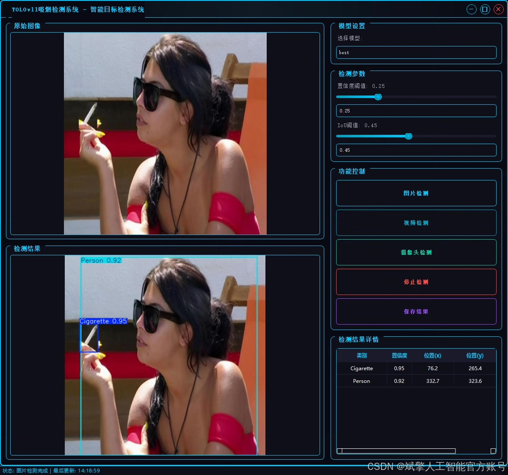
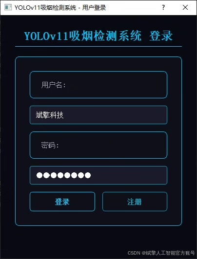
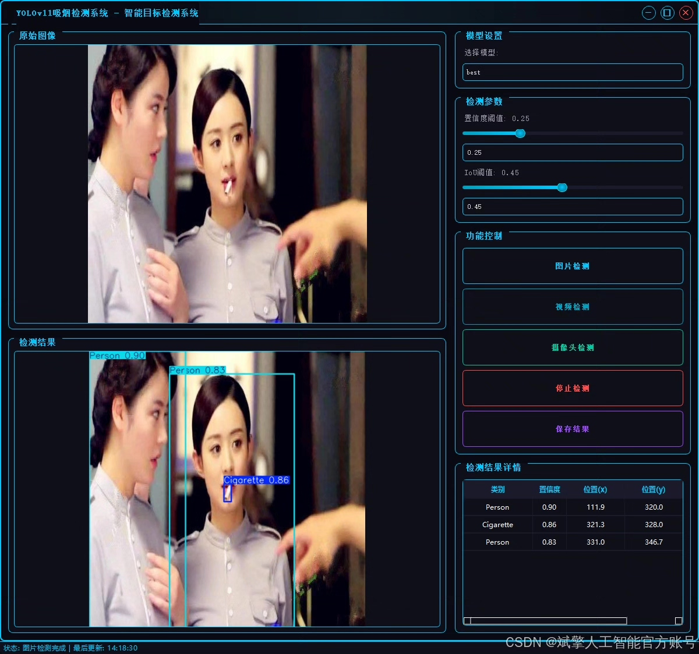
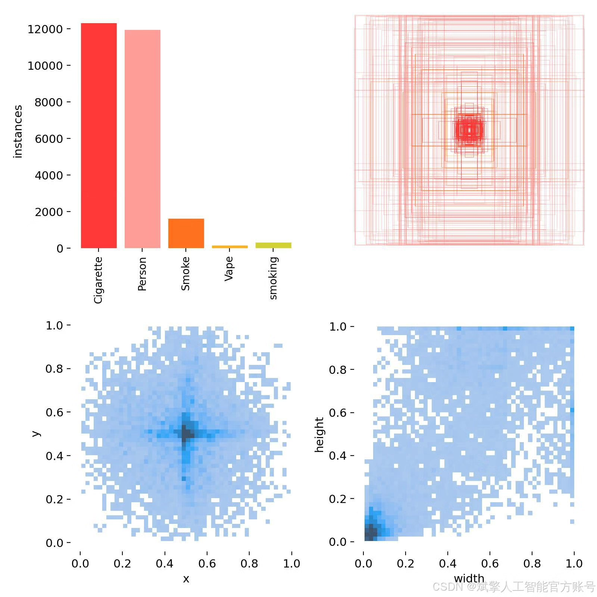
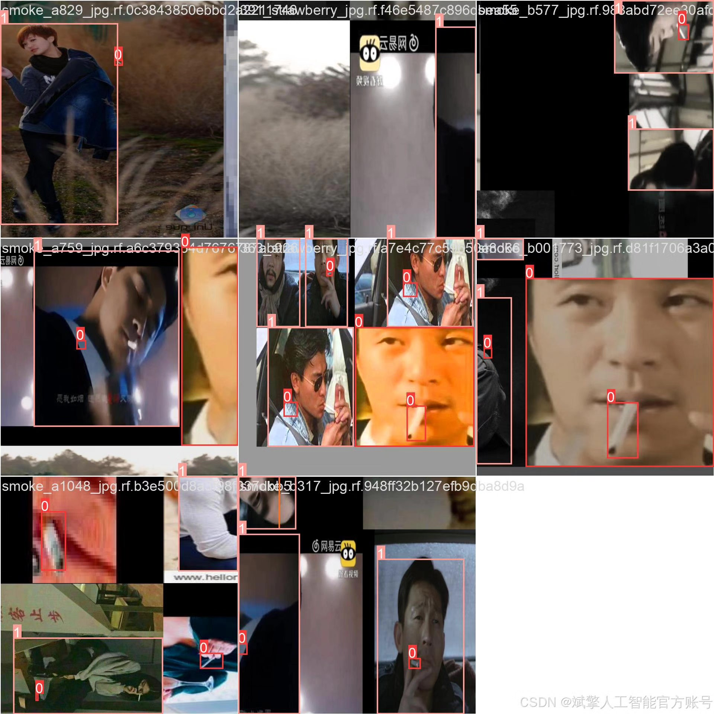
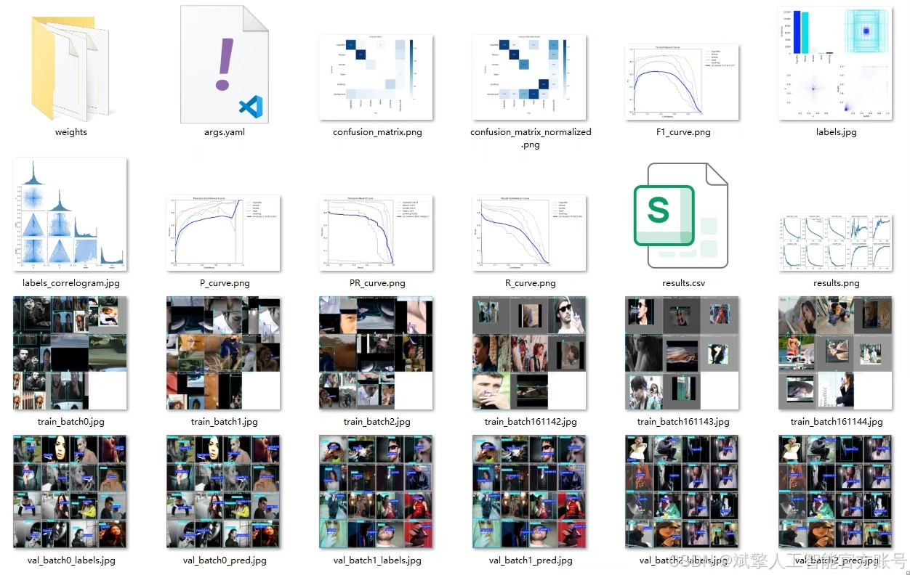
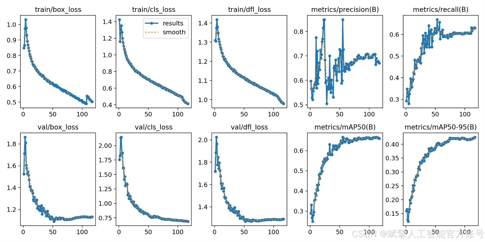
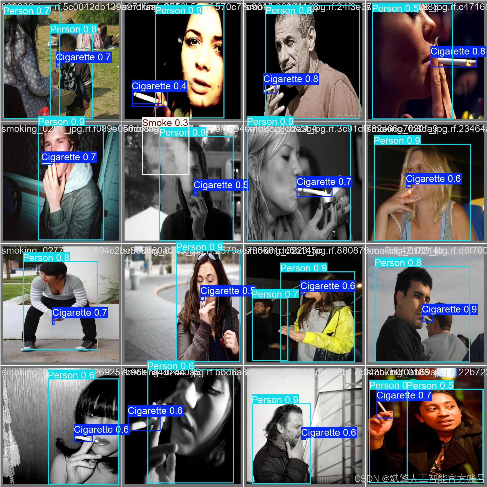

# YOLOv11 Smoking Behavior Detection System

## Body

YOLOv11 Smoking Behavior Detection System Based on Deep Learning YOLOv11: A High-Accuracy, Real-Time Smoking Behavior Detection System (YOLOv11+YOLO dataset + UI interface + login registration interface + Python project source code + model)

The purpose of this project is to develop a high-precision, real-time smoking behavior detection system based on the YOLOv11 architecture. The system can accurately identify and locate five key targets through end-to-end analysis of surveillance footage or images: cigarettes (Cigarette), people (Person), smoke (Smoke), e-cigarettes (Vape), and comprehensive smoking behavior (smoking). This model has been thoroughly trained on a dataset containing more than 12,000 labeled images, demonstrating strong feature learning and generalization capabilities. Such technology can be widely applied in safety production monitoring, public places against smoking regulations, intelligent security, and other fields, providing an effective technical solution for automated violation behavior recognition, helping to achieve intelligent management.

✅ User Login and Registration: Supports password verification and security validation.
✅ Three Detection Modes: Based on the YOLOv11 model, supports image, video, and real-time camera detection, accurately identifying targets.
✅ Dual-Screen Comparison: Displays the original scene and detection results on the same screen.
✅ Data Visualization: Real-time table displaying the category, confidence, and coordinates of detected targets.
✅ Intelligent Parameter Tuning: Offers a confidence slide bar to dynamically optimize detection accuracy, adapting to different scene requirements.
✅ Sci-Fi Interactive Interface: Dark theme combined with dynamic light effects, reducing visual fatigue and improving operational experience.

## Images

## Payment

Here is a pay link on Stripe ( https://buy.stripe.com/3cs8yP7sY87d0vu9AB ). Please contact me lonlonago@foxmail.com after funding $89, and I will send you a complete data files , thank you!

